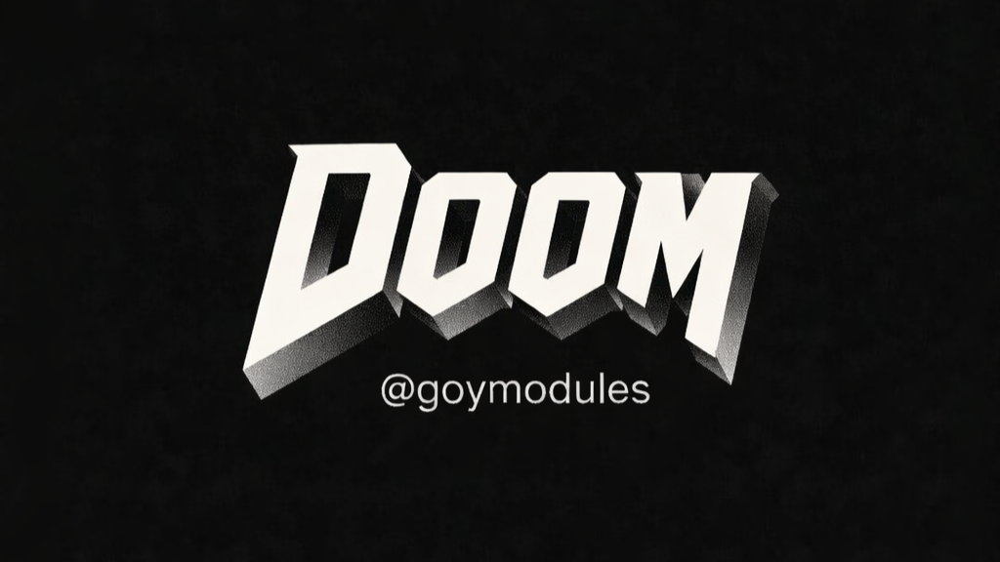

# Doom — README RU

[](https://t.me/goymodules)



## О модуле
Doom — развлекательный модуль, который запускает мини-игру прямо в Telegram через inline-интерфейс.

## Как пользоваться
1. Установите модуль.
2. Вызовите `.doom` для запуска меню.
3. Используйте `.hdoom`, чтобы открыть краткую справку.

## Файл
- `doom.py`

## Установка
```text
.dlm https://raw.githubusercontent.com/sepiol026-wq/goypulse/main/doom.py
```

## Команды
- `.doom`
- `.hdoom`

## Навигация
- [Назад в русский индекс](./readme_ru.md)
- [English version](./readme_doom_en.md)

## Лицензия
Этот README и модуль защищены лицензией **GNU AGPLv3**. Подробности: [LICENSE](../LICENSE).
