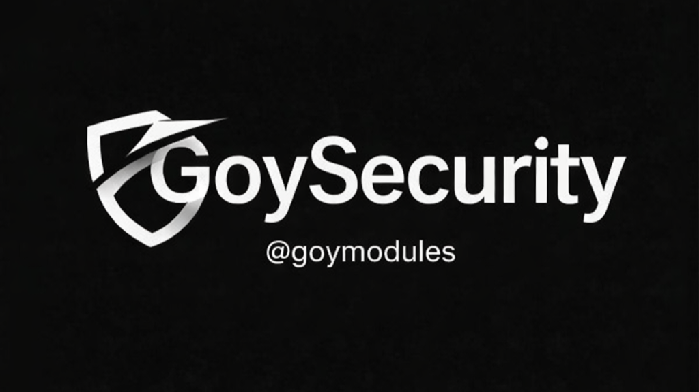

# GoySecurity — README RU

[](https://t.me/goymodules)



## Что это за модуль
GoySecurity — модуль предварительной проверки кода перед установкой сторонних модулей. Он снижает риск запуска подозрительных скриптов и помогает контролировать доверенные источники.

## Как это работает
- Выполняет скан кода по правилам риска.
- Поддерживает режимы строгости.
- Ведёт историю проверок.
- Даёт объяснение «почему риск» и поддерживает whitelist.

## Файл модуля
- `goysec.py`

## Установка
```text
.dlm https://raw.githubusercontent.com/sepiol026-wq/goypulse/main/goysec.py
```

## Основные команды
- `.gscan` — скан текущего модуля/ссылки.
- `.gautoscan` — автоскан перед установкой.
- `.gmode` — уровень строгости.
- `.gwl` / `.gunwl` — управление whitelist.
- `.ghist` / `.gwhy` — история и причины срабатывания.
- `.gai` / `.gaicustom` — AI-пояснения.

## Навигация
- [Назад в русский индекс](./readme_ru.md)
- [English version](./readme_goysec_en.md)

## Лицензия
Этот README и модуль защищены лицензией **GNU AGPLv3**. Подробности: [LICENSE](../LICENSE).
