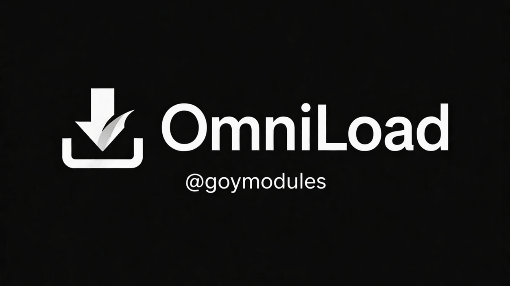

# OmniLoad - README RU

[](https://t.me/goymodules)



## О модуле
Универсальный загрузчик медиа по ссылкам и источникам.

## Файл модуля
- `omni.py`

## Быстрый старт
```text
.dlm https://raw.githubusercontent.com/sepiol026-wq/goypulse/main/omni.py
```

## Команды
- `.dl`

## Навигация
- [Назад в русский индекс](./readme_ru.md)
- [English version](./readme_omniload_en.md)

## Контакты
- Telegram канал: [@goymodules](https://t.me/goymodules)
