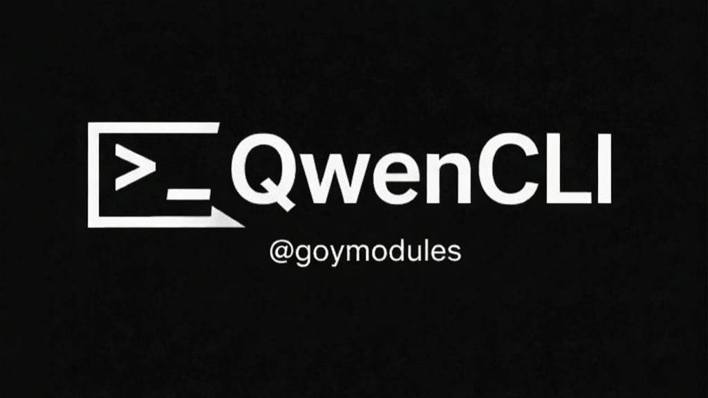

# QwenCLI - README EN

[](https://t.me/goymodules)



## About module
Unified AI assistant module for Heroku workflows and chat tasks.

## Module file
- `QwenCLI.py`

## Quick install
```text
.dlm https://raw.githubusercontent.com/sepiol026-wq/goypulse/main/QwenCLI.py
```

## Commands
- Commands are not exposed as *cmd-methods* in code.

## Navigation
- [Back to English index](./readme_en.md)
- [Русская версия](./readme_qwencli_ru.md)

## Contacts
- Telegram channel: [@goymodules](https://t.me/goymodules)
