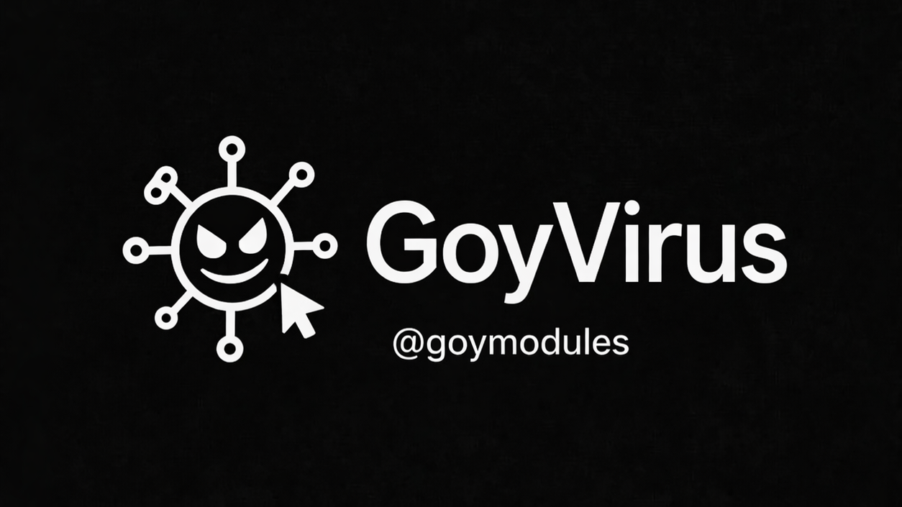

# GoyModules — RU

  

<a href="../README.md"><strong>Root</strong></a> • <a href="./readme_en.md"><strong>EN</strong></a>

## Модули

Нажимай на карточку — она ведёт сразу в нужный `readme`.

<table>
  <tr>
    <td align="center" width="50%">
      
       <strong><a href="./readme_goypulse_ru.md">GoyPulse</a></strong>
       Utility • Watcher
       Умный автоответчик на цепях Маркова.
       <a href="./readme_goypulse_ru.md"><strong>Открыть README</strong></a>
    </td>
    <td align="center" width="50%">
      
       <strong><a href="./readme_goysec_ru.md">GoySecurity</a></strong>
       Security
       Проверка модулей перед установкой.
       <a href="./readme_goysec_ru.md"><strong>Открыть README</strong></a>
    </td>
  </tr>
  <tr>
    <td align="center" width="50%">
      
       <strong><a href="./readme_qwencli_ru.md">QwenCLI</a></strong>
       CLI / AI • Watcher
       AI-модуль для задач и автоматизации.
       <a href="./readme_qwencli_ru.md"><strong>Открыть README</strong></a>
    </td>
    <td align="center" width="50%">
      
       <strong><a href="./readme_codexcli_ru.md">CodexCLI</a></strong>
       CLI / AI • Watcher
       Codex-форк для dev workflow.
       <a href="./readme_codexcli_ru.md"><strong>Открыть README</strong></a>
    </td>
  </tr>
  <tr>
    <td align="center" width="50%">
      
       <strong><a href="./readme_omniload_ru.md">OmniLoad</a></strong>
       CLI / Tools
       Быстрая загрузка медиа по ссылке.
       <a href="./readme_omniload_ru.md"><strong>Открыть README</strong></a>
    </td>
    <td align="center" width="50%">
      
       <strong><a href="./readme_recon_ru.md">Recon</a></strong>
       Security / OSINT
       Recon и инфраструктурный обзор.
       <a href="./readme_recon_ru.md"><strong>Открыть README</strong></a>
    </td>
  </tr>
  <tr>
    <td align="center" width="50%">
      
       <strong><a href="./readme_keyscanner_ru.md">KeyScanner</a></strong>
       Security • Watcher
       Поиск и проверка API-ключей.
       <a href="./readme_keyscanner_ru.md"><strong>Открыть README</strong></a>
    </td>
    <td align="center" width="50%">
      
       <strong><a href="./readme_ytmusic_ru.md">YTMusic</a></strong>
       Music
       YouTube-плейлисты и треки.
       <a href="./readme_ytmusic_ru.md"><strong>Открыть README</strong></a>
    </td>
  </tr>
  <tr>
    <td align="center" width="50%">
      
       <strong><a href="./readme_soundcloudmusic_ru.md">SoundCloudMusic</a></strong>
       Music
       SoundCloud-поиск и локальные плейлисты.
       <a href="./readme_soundcloudmusic_ru.md"><strong>Открыть README</strong></a>
    </td>
    <td align="center" width="50%">
      
       <strong><a href="./readme_doom_ru.md">Doom</a></strong>
       Fun
       Мини-игра DOOM прямо в Telegram.
       <a href="./readme_doom_ru.md"><strong>Открыть README</strong></a>
    </td>
  </tr>
  <tr>
    <td align="center" width="50%">
      
       <strong><a href="./readme_goyvirus_ru.md">GoyVirus</a></strong>
       Fun / Utility
       Шуточный prank-модуль.
       <a href="./readme_goyvirus_ru.md"><strong>Открыть README</strong></a>
    </td>
    <td width="50%"></td>
  </tr>
</table>

