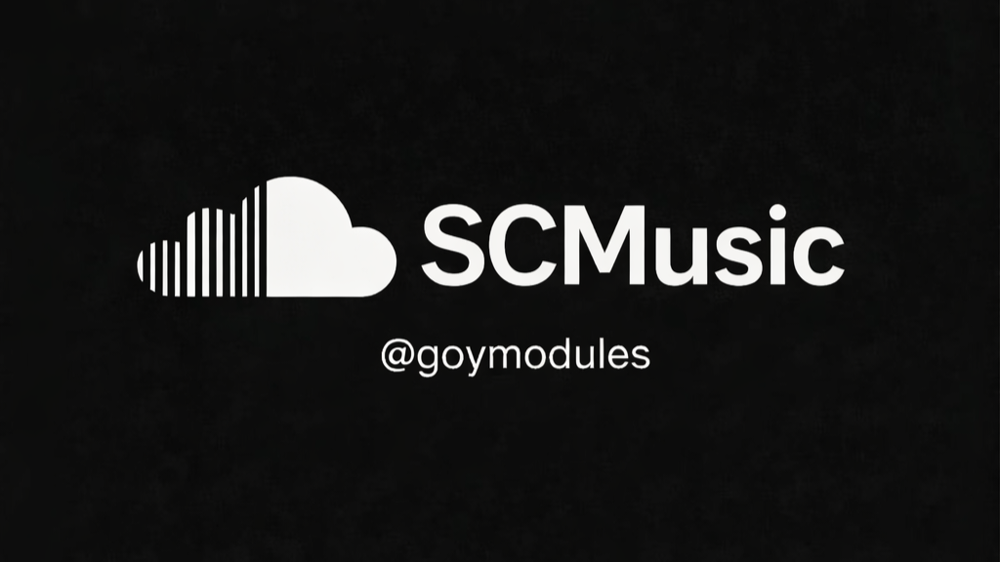

# SoundCloudMusic — README EN

[](https://t.me/goymodules)



## About module
SoundCloudMusic turns your userbot into a music workflow tool: search tracks, dump audio to chat, and manage local playlist databases.

## How it works
- Searches SoundCloud by query.
- Downloads/sends selected tracks.
- Stores playlist collections in local DB.
- Supports import/export and batch playlist ingest.

## Module file
- `sc.py`

## Installation
```text
.dlm https://raw.githubusercontent.com/sepiol026-wq/goypulse/main/sc.py
```

## Commands
- `.sc`, `.scpl`, `.scadd`, `.scrm`
- `.scimport`, `.scexport`, `.scbatch`

## Navigation
- [Back to English index](./readme_en.md)
- [Русская версия](./readme_soundcloudmusic_ru.md)

## License
This README and module are protected under **GNU AGPLv3**. Details: [LICENSE](../LICENSE).
