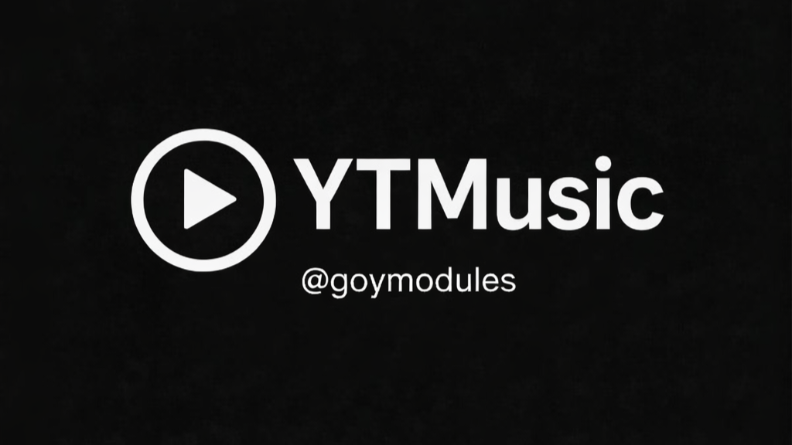

# YTMusic - README RU

[](https://t.me/goymodules)



## О модуле
YouTube Music модуль с баннерами, плейлистами и импортом/экспортом.

## Файл модуля
- `yt.py`

## Быстрый старт
```text
.dlm https://raw.githubusercontent.com/sepiol026-wq/goypulse/main/yt.py
```

## Команды
- `.yt`
- `.ytpl`
- `.ytadd`
- `.ytrm`
- `.ytimport`
- `.ytexport`
- `.ytbatch`

## Навигация
- [Назад в русский индекс](./readme_ru.md)
- [English version](./readme_ytmusic_en.md)

## Контакты
- Telegram канал: [@goymodules](https://t.me/goymodules)
